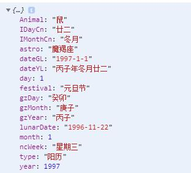

#使用
1.引用
import calendar from '@/components/calendar-boke/calendar.vue'
components:{
			calendar
		},
2.html标签
<calendar ref="calendar1"  @confirm="confirm"/>
3 操作/返回

<!-- 打开蒙版 -->
that.$refs.calendar1.isShowDateMask = true

<!-- 切换阳历阴历-->
that.$refs.calendar1.switchBtn('solar') //str = 'solar' || 'lunar'

confirm(dt){ //确定返回数据
	console.log(dt);
},

返回数据如图
